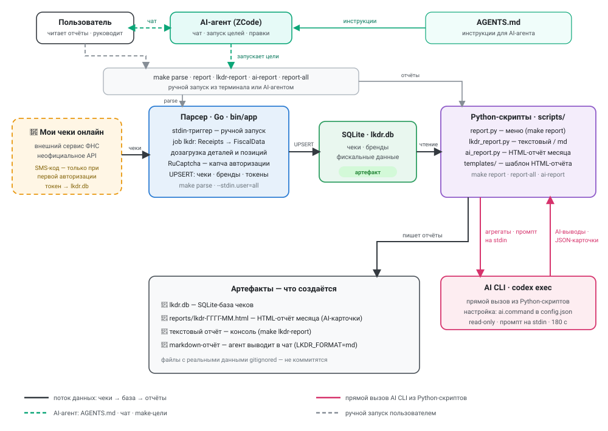

# LedgerFox

Сбор чеков ФНС «Мои чеки онлайн» в локальную SQLite-базу: задача `lkdr`
загружает и сохраняет данные, ручной запуск — через stdin-триггер.

Проект основан на [hoarder](https://github.com/jfk9w/hoarder) — благодарность
[Igor Kulkov](https://github.com/jfk9w) за исходный код.

## Пример отчёта

Оба примера сгенерированы самим проектом на **полностью синтетических
данных** — вымышленные магазины, товары и суммы, никаких реальных покупок.

**Текстовый отчёт** — `make lkdr-report`, вывод в консоль (фрагмент):

```text
Отчет по покупкам
-----------------
База данных: lkdr.db
Текущий период: 2026-08-29 09:15 - 2026-09-28 09:15
Период сравнения: 2026-07-30 09:15 - 2026-08-29 09:15

Короткий вывод (рубли)
----------------------
Чистые расходы: 9 669.00 ₽ против 5 696.00 ₽ (+3 973.00 ₽ (+69.8%))
Среднее в день: 322.30 ₽ против 189.87 ₽ (+132.43 ₽ (+69.8%))

Категории (рубли)
-----------------
Категория          Сейчас      Было        Изменение  Доля
-----------------  ----------  ----------  ---------  ----------------
Транспорт          2 450.00 ₽  2 300.00 ₽  +150.00 ₽  ███░░░░░░░ 25.3%
Напитки            2 090.00 ₽  1 340.00 ₽  +750.00 ₽  ███░░░░░░░ 21.6%
Бытовая химия      1 080.00 ₽  535.00 ₽    +545.00 ₽  ██░░░░░░░░ 11.2%
Молочные продукты  894.00 ₽    438.00 ₽    +456.00 ₽  █░░░░░░░░░ 9.2%
Аптека и здоровье  850.00 ₽    0.00 ₽      +850.00 ₽  █░░░░░░░░░ 8.8%
Готовая еда        780.00 ₽    390.00 ₽    +390.00 ₽  █░░░░░░░░░ 8.1%
```

Категория «Аптека и здоровье» в примере — приватная: видна только сумма,
названия товаров не выводятся построчно и не уходят в AI-промпты
(`reports.privateCategories`).

<details>
<summary><b>Полный вывод текстового отчёта</b> (магазины, товары, повторяющиеся покупки)</summary>

```text
Главные изменения (рубли)
-------------------------
Топ-5 изменений по магазинам
Магазин               Сейчас      Было        Изменение
--------------------  ----------  ----------  -----------
Супермаркет «Калина»  4 739.00 ₽  2 611.00 ₽  +2 128.00 ₽
Аптека «Городская»    850.00 ₽    0.00 ₽      +850.00 ₽
Кофейня «У метро»     850.00 ₽    395.00 ₽    +455.00 ₽
Кафе «Ложка»          780.00 ₽    390.00 ₽    +390.00 ₽
АЗС «Меридиан»        2 200.00 ₽  2 050.00 ₽  +150.00 ₽

Топ-5 изменений по товарам
Товар                    Сейчас    Было      Изменение
-----------------------  --------  --------  ---------
Курица охлаждённая       420.00 ₽  0.00 ₽    +420.00 ₽
Обед бизнес-ланч в кафе  780.00 ₽  390.00 ₽  +390.00 ₽
Молоко 3.2% 950мл        514.00 ₽  128.00 ₽  +386.00 ₽
Бумага туалетная 12шт    340.00 ₽  0.00 ₽    +340.00 ₽
Вода без газа 5л         260.00 ₽  0.00 ₽    +260.00 ₽

Итоги (рубли)
-------------
Показатель            Значение
--------------------  ----------
Чистые расходы        9 669.00 ₽
Покупочные чеки       10
Средний чек           966.90 ₽
Среднее в день        322.30 ₽

Основная разбивка (рубли)
-------------------------
Топ-5 магазинов
Магазин               Чеки  Сейчас      Было        Изменение    Доля
--------------------  ----  ----------  ----------  -----------  ----------------
Супермаркет «Калина»  4     4 739.00 ₽  2 611.00 ₽  +2 128.00 ₽  █████░░░░░ 49.0%
АЗС «Меридиан»        1     2 200.00 ₽  2 050.00 ₽  +150.00 ₽    ███░░░░░░░ 22.8%
Кофейня «У метро»     2     850.00 ₽    395.00 ₽    +455.00 ₽    █░░░░░░░░░ 8.8%
Аптека «Городская»    1     850.00 ₽    0.00 ₽      +850.00 ₽    █░░░░░░░░░ 8.8%
Кафе «Ложка»          1     780.00 ₽    390.00 ₽    +390.00 ₽    █░░░░░░░░░ 8.1%

Товары (рубли)
--------------
Топ-5 товаров
Товар                    Кол-во  Сейчас      Было        Изменение  Доля
-----------------------  ------  ----------  ----------  ---------  ----------------
Бензин АИ-95             40      2 200.00 ₽  2 050.00 ₽  +150.00 ₽  ███░░░░░░░ 22.8%
Кофе в зёрнах 1кг        1       950.00 ₽    930.00 ₽    +20.00 ₽   █░░░░░░░░░ 9.8%
Обед бизнес-ланч в кафе  2       780.00 ₽    390.00 ₽    +390.00 ₽  █░░░░░░░░░ 8.1%
Молоко 3.2% 950мл        8       514.00 ₽    128.00 ₽    +386.00 ₽  █░░░░░░░░░ 5.3%
Кофе латте 0.4л          2       440.00 ₽    220.00 ₽    +220.00 ₽  █░░░░░░░░░ 4.6%

Топ-5 повторяющихся покупок
Товар              Покупки  Кол-во  Сейчас    Было      Изменение  Средняя цена
-----------------  -------  ------  --------  --------  ---------  ------------
Молоко 3.2% 950мл  4        8       514.00 ₽  128.00 ₽  +386.00 ₽  64.25 ₽

Корзина продуктов на неделю (рубли)
-----------------------------------
Топ-1 · Каждую неделю
Продукт            Кол-во/нед  ~Сумма/нед  Срок годности
-----------------  ----------  ----------  -------------
Молоко 3.2% 950мл  0.39        24.97 ₽     ~7 дн.
Ориентир трат в неделю по корзине: 24.97 ₽.
```

</details>

**HTML-отчёт месяца** — `make ai-report`:

- [**Открыть пример HTML-отчёта**](https://htmlpreview.github.io/?https://github.com/ar2r/ledger-fox/blob/master/docs/example-report.html) —
  отрендеренный вид в браузере;
- [docs/example-report.html](docs/example-report.html) — файл в репозитории
  (сгенерирован с `--no-ai`: карточки детерминированные, без вызова AI; один
  файл, без внешних зависимостей).

## Состав проекта



- **Мои чеки онлайн** — внешний сервис ФНС и источник данных: парсер ходит в
  неофициальное API, SMS-код и капча нужны только при первой авторизации.
- **Парсер (Go, `bin/app`)** — по stdin-триггеру забирает чеки (загрузчики
  `Receipts` → `FiscalData`, RuCaptcha для первой авторизации) и складывает
  их в локальную SQLite-базу `lkdr.db`.
- **Python-скрипты (`scripts/reports/`)** — читают базу и собирают отчёты:
  текстовый/markdown (`lkdr_report.py`), HTML-отчёт месяца (`ai_report.py` по
  шаблону `scripts/templates/`), интерактивное меню (`report.py`).
- **Артефакты** — `lkdr.db`, HTML-отчёт `reports/lkdr-ГГГГ-ММ.html`,
  текстовый отчёт в консоли и markdown-версия для чата агента; файлы с
  реальными данными gitignored.
- **Два независимых AI-пути**:
  - Python-скрипты вызывают **AI CLI напрямую** — по умолчанию
    `codex exec --sandbox read-only` (настраивается `ai.command`): AI-карточки
    HTML-отчёта и AI-выводы текстового отчёта (`--ai-summary`);
  - **AI-агент (ZCode)** работает с проектом по инструкциям из `AGENTS.md`:
    запускает те же make-цели, правит код, по просьбе выводит markdown-отчёт
    прямо в чат. Агент с AI CLI не пересекается.

## Безопасность и приватность

**Что хранится на вашем компьютере.** Все собранные данные остаются локально:
SQLite-база `lkdr.db` (чеки с датами, магазинами и суммами; фискальные данные
с составом покупок — названия позиций, цены, количество; бренды; токены
авторизации ФНС), `config.json` (номера телефонов, ключ RuCaptcha) и
сгенерированные отчёты в `reports/`. Всё это уже исключено из Git
(`.gitignore`) — персональные данные и секреты в репозиторий не попадут.

**Что уходит наружу при сборе чеков.** Только два направления: запросы к
неофициальному API ФНС «Мои чеки онлайн» (получить ваши же чеки) и — один
раз, при первой авторизации — картинка капчи в RuCaptcha вместе с вашим
API-ключом этого сервиса. SMS-код приходит на ваш телефон, приложение лишь
подставляет его при входе. Телеметрии и других внешних сервисов нет.

**Что уходит наружу через AI.** Пути два, и оба настраиваете вы сами:

- Python-скрипты с включённым AI (`make ai-report`, `--ai-summary`) отправляют
  во внешний AI CLI — по умолчанию `codex exec`, заменяется `ai.command` в
  `config.json` — агрегаты отчёта, названия товаров (сокращённые до
  `reports.maxItemNameChars`) и небольшой служебный контекст промпта, включая
  семейный контекст из локального `FAMILY.md` (портрет семьи: состав, привычки
  питания, акценты; заполняется по интервью с AI-агентом, шаблон —
  `FAMILY.md.dist`, в Git не попадает). Товары
  приватных категорий (`reports.privateCategories`, по умолчанию «Аптека и
  здоровье» и «Косметика и гигиена») в AI-промпты не попадают — видна только
  сумма по категории.
- AI-агент (ZCode или иной) работает с проектом в тех границах доступа,
  которые выдали именно вы: может читать локальные файлы (базу, конфиг с
  секретами, отчёты) и запускать команды. Что агент и куда передаёт дальше —
  определяется вашим агентом, его провайдером и вашими настройками.

**Ответственность.** Выбор AI CLI и AI-агента — целиком на пользователе.
Риски того, что именно отправлять настроенному вами AI-агенту и его
провайдеру, каждый пользователь принимает на себя самостоятельно.

## Документация

- [Начало работы](docs/getting-started.md) — сборка, конфиг, первый запуск, устройство приложения;
- [Конфигурация](docs/configuration.md) — справочник по `config.json`;
- [Разработка](docs/development.md) — команды, тесты, мок-сервис ФНС, свои Python-отчёты;
- [Отчёт по покупкам LKDR](docs/lkdr-report.md) — полный гайд по основному отчёту.

## Быстрый старт: настройка с нуля

Требуется Go 1.27+. Соберите бинарник:

```bash
make build
```

### 1. Создайте `config.json` в корне проекта

```json
{
  "log": { "level": "INFO" },
  "stdin": { "enabled": true },
  "captcha": { "rucaptchaKey": "<API-ключ RuCaptcha>" },
  "lkdr": {
    "enabled": true,
    "database": { "dsn": "lkdr.db" },
    "users": {
      "default": [{ "phone": "79001234567" }]
    }
  }
}
```

### 2. Что заполнить

| Поле | Что сюда вписать |
|------|------------------|
| `lkdr.users.default[0].phone` | Номер телефона, привязанный к ЛК ФНС «Мои чеки онлайн», в формате `7XXXXXXXXXX`. Ключ `default` — внутренний ID пользователя (любое имя). Пароль не нужен: при первой авторизации приложение запросит код из СМС. |
| `captcha.rucaptchaKey` | API-ключ с [rucaptcha.com](https://rucaptcha.com). Нужен для первой авторизации: приложение решает капчу автоматически через API. Без ключа первая авторизация невозможна (ошибка `authorizer is required, but not set`) — подробности в [«Начало работы»](docs/getting-started.md#частые-проблемы). |
| `lkdr.database.dsn` | Путь к файлу базы SQLite — пример выше создаст локальный `lkdr.db`. |

`config.json` содержит личные данные — он уже исключён из Git (`.gitignore`), не коммитите его.

### 3. Первый запуск

```bash
make parse
# или напрямую:
./bin/app --config.file=config.json --stdin.user=all
```

`make parse` выполняет парсинг чеков **всех пользователей из конфигурации
по очереди**: чеки пользователя загружаются до конца, затем приложение
переходит к следующему, а после последнего — завершается. Конфиг по
умолчанию `./config.json` (переопределяется: `make parse CONFIG_FILE=…`).
Отладочный вариант с DEBUG-логами и сужением до одного пользователя:
`make run RUN_USER=default`. Порядок — по алфавиту ID.

Приложение запросит код из СМС, авторизуется и начнёт выгрузку (первая
синхронизация телефона — за последние 12 месяцев, далее — только новые чеки
от самого свежего загруженного; настроек глубины нет, накопленная история
остаётся в базе). Токены
сохраняются в базе: повторная авторизация не потребуется. Код возврата `0` —
успех, `1` — ошибка задачи.

Ограничить объём выгрузки для живого теста (максимум запросов на загрузчик
за запуск; остановка по лимиту — не ошибка, следующий запуск продолжит):

```bash
./bin/app --config.file=config.json --stdin.user=default --lkdr.maxRequests=2 --lkdr.batchSize=10
```

По умолчанию вывод — текстовый, для человека (логи с коротким временем
и понятные сообщения вроде «загружен чек»). Полезные флаги:

- `--debug` — детальный вывод (уровень DEBUG вместо INFO);
- `--json` — весь вывод (логи и сообщения триггера) построчным JSON — для скриптов;
- комбинации работают вместе: `--debug --json`.

```bash
./bin/app --json --config.file=config.json --stdin.user=all
```

### 4. Отчёты

```bash
make report
```

`make report` открывает интерактивное меню Python-отчётов (выбор номером
или id). Основной отчёт по покупкам можно запустить и напрямую:
`make lkdr-report`. HTML-отчёт месяца с AI-выводами:
`make ai-report` — создаёт/обновляет `reports/lkdr-ГГГГ-ММ.html`.
Всё сразу и без вопросов — `make report-all`: обновит HTML-отчёт и напечатает
текстовый отчёт с AI-выводами и рекомендациями в консоль.
Как добавить свой отчёт — в [документации](docs/development.md#python-отчёты-меню-и-свои-скрипты).

## Лицензия

[MIT](LICENSE). Форк сохраняет лицензию и авторство исходного проекта.
